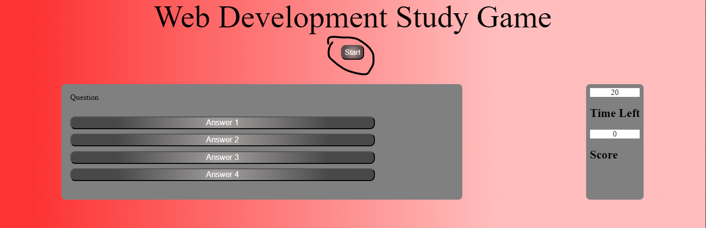
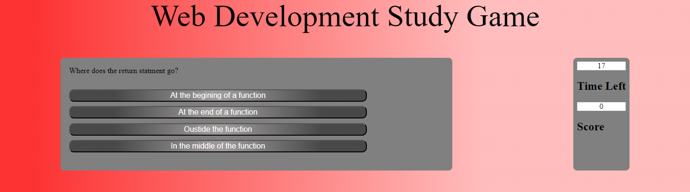
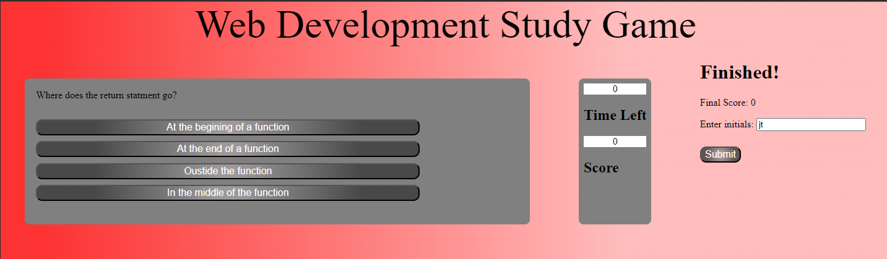
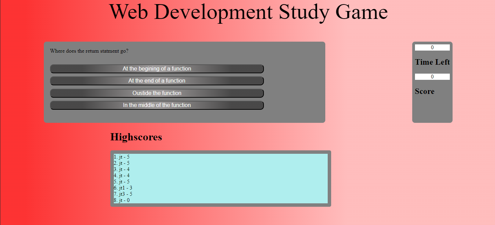

# Web Development Study Game

## Table of Contents

- [Project description](#Description)
- [Usage](#Usage)
- [Installation](#Installation)
- [Contributing](#Contributing)
- [Tests](#Tests)
- [Questions](#Questions)
- [Project License](#License)

## Description

A web development study game that runs in the browser.

## Usage

Visit the deployed site.

Click the start button.

Answer the questions.

Enter your initials and click submit.

View your highscores.

## Installation

N\A

## Contribute

N\A

## Tests

N\A

## Questions

You can reach me with any questions below.

- [GitHub](https://github.com/Radioactive-mtb)
- Email - justen27@live.com

## License

This project is covered under the MIT license.
[MIT](https://choosealicense.com/licenses/mit)
